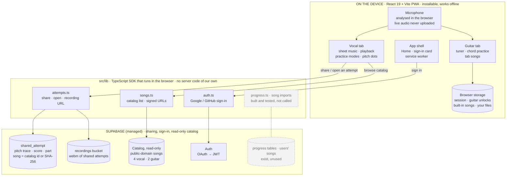
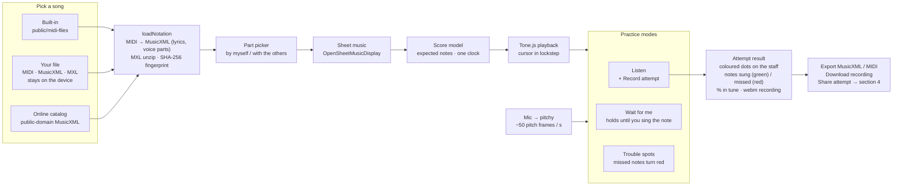
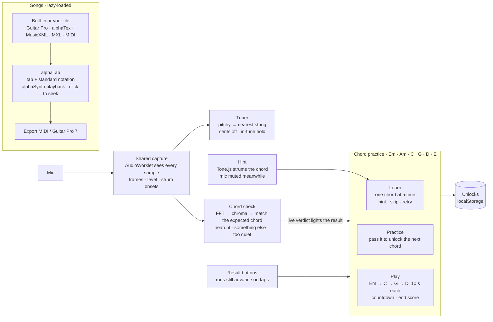
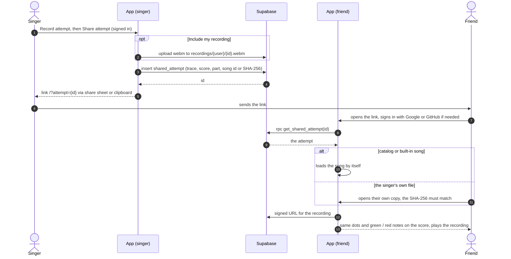

# M2 — Design and Setup (10%)

Milestone rubric and where Harmonic stands against it. Current as of
**2026-09-30** (`main`, deployed at **https://harmonic-vert.vercel.app**).

| Rubric item | Status | Where |
|---|---|---|
| **Architecture** — boxes and arrows (clients, APIs, data, jobs) | ✅ Done | Figures 1–4 below; full write-up in [`docs/architecture.md`](architecture.md) |
| **Stack** — what + one-sentence why | ✅ Done | [Stack](#stack-one-sentence-why-each) |
| **Clonable repo with CI skeleton** (lint / test / build) | ✅ Done | `.github/workflows/ci.yml`: `backend` (oxlint, `tsc`, vitest) and `app` (oxlint, vitest, `vite build`) on every PR; on `main` also `migrate` (`supabase db push`) and `deploy` (Vercel). Locally `npm run ci` |
| **Minimal prototype that runs** | ✅ Deployed | https://harmonic-vert.vercel.app — Vocal: sheet music, playback, practice modes, pitch dots, notes sung / missed, share an attempt. Guitar: tuner, chord practice with chord check by ear, tab songs. Tests: 170 app + 37 backend (against the live Supabase project) |
| **Design doc connected to requirements** | ✅ Done | [`Harmonic-design-doc.md`](../Harmonic-design-doc.md); `openspec/` ties each requirement to its F#/N# id in the [specifications repo](https://github.com/Harmonic-416/specifications/blob/main/2-scope/requirements.md) |

**In one line:** everything runs on the device; the server is only used to
**share an attempt**, to **sign in** (Google / GitHub, needed only to share),
and to read a small **public-domain catalog**. Songs are never uploaded
(copyright).

## Figure 1 — System overview

Grey dashed boxes exist in code and database but the app doesn't call them.

## Figure 2 — Vocal tab

Dot colours: green in tune, yellow close, blue other octave, red wrong, grey rest.

## Figure 3 — Guitar tab

Nothing in the Guitar tab talks to the server.

## Figure 4 — Sharing an attempt (the only server write)

## Data model (Supabase)

RLS on every table: a user only reaches rows where `user_id = auth.uid()`,
except where noted. Migrations `0001`–`0005`, applied by CI.

| Table / bucket | Holds | Access | Used by the app |
|---|---|---|---|
| `shared_attempt` | pitch trace, score, part, song (catalog id or SHA-256), optional recording path | owner; any signed-in user opens one by id via `get_shared_attempt()` | ✅ sharing |
| `song` + `notation/seed/` | 6 public-domain catalog songs (MusicXML) | anyone, read-only | ✅ catalog |
| `recordings` bucket | webm of shared attempts | owner; readable by signed-in users only when attached to a share | ✅ sharing |
| `profiles` | one row per user (sign-up trigger) | owner | ✅ |
| `run_through`, `recording`, `lesson_progress`, `song_pref` | history, recordings, unlocks, tempo | owner | ⬜ built and tested, not called |

## Stack (one sentence why, each)

- **React 19 + Vite, PWA (vite-plugin-pwa / Workbox)** — installable, works offline, fastest iteration loop; heavy parts load on first use.
- **OpenSheetMusicDisplay** (voice) — renders MusicXML, and its cursor is the single clock for playback, cursor and scoring.
- **alphaTab** (guitar) — the only web renderer that draws tab; plays (alphaSynth) and exports MIDI / Guitar Pro; lazy-loaded.
- **Tone.js + @tonejs/midi + jszip** — voice playback clock and synth, MIDI import / export, MXL unzip.
- **pitchy on Web Audio** — client-side pitch tracking, so live audio never leaves the device.
- **AudioWorklet capture** — sees every mic sample, so strum onsets aren't missed; feeds the tuner and the chord check.
- **Supabase (Postgres + Auth + Storage)** — sign-in, sharing and the catalog with no server code of our own; security is row-level security in the database.
- **GitHub Actions + Supabase CLI + Vercel** — CI on every PR; on `main`, migrate then deploy.

## Not done yet

- Lesson map (F2/F3) — shelved.
- Progress and run history are not saved (backend ready, `progress.ts` unused); guitar unlocks live in `localStorage`.
- Guitar runs still advance on the result buttons; per-string feedback isn't wired to the chord check.
- Real iPhone Safari test (N2) and latency measurement (N1).
- "Save PDF" of an attempt exists only on branch `feat/share-attempts` (demo: https://harmonic-share.vercel.app), not on `main`.
