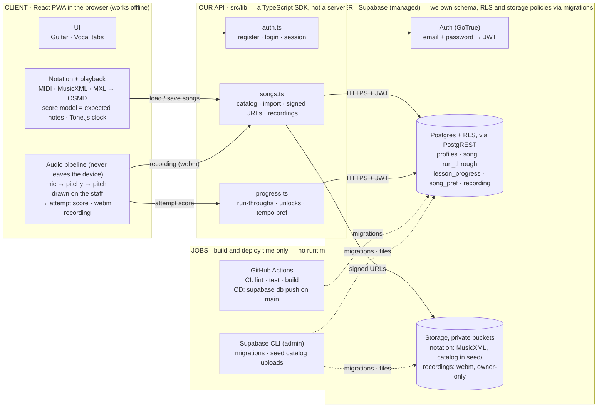

# Harmonic — architecture

Status: current as of 2026-09-22 (M2). Owner: whole team. This is the
"boxes and arrows" document for the rubric; the requirement-by-requirement
design lives in `openspec/` and the capacity plan in `docs/scaling-plan.md`.

## In three sentences

Harmonic is an installable web app (React + Vite PWA) that turns any MIDI,
MusicXML or MXL file into sheet music you can hear: the file is converted to
MusicXML in the browser, rendered with OpenSheetMusicDisplay, and played back
by Tone.js in lockstep with a moving cursor, with all timing taken from the
rendered score itself. When you sing along, your microphone is analysed
entirely on your device: pitch is tracked about fifty times a second, drawn
onto the staff as coloured dots, and scored against the melody when the song
ends. A thin Supabase backend supplies accounts, a shared song catalog, each
user's own library (stored as MusicXML in a private bucket) and progress
rows, all guarded by row-level security, so nothing but small rows and
optional compressed recordings ever leaves the phone.

## Diagram



Lanes left to right; solid arrows are runtime calls, dotted arrows are
deploy-time. There is no server code of our own: "our API" is the typed SDK
in `src/lib`, and everything server-side we own is declarative (migrations
for schema, RLS, bucket policies, seed catalog). The diagram's source of
truth is [`3-architecture/rough-architecture.md` in the specifications
repo](https://github.com/Harmonic-416/specifications/blob/docs/compact-architecture/3-architecture/rough-architecture.md)
(separate repository, `Harmonic-416/specifications`); keep the two in sync.

There are no runtime jobs, queues or custom servers: everything real-time
is on the client, everything persistent is a Supabase row or object.

## Components

### Client (`app/`)

React 19 + Vite 8, packaged as a PWA by `vite-plugin-pwa` (Workbox precache,
4 MiB limit because OSMD + Tone + supabase-js are large). Two tabs: **Guitar**
(placeholder) and **Vocal**, which is the product today.

| Module | Responsibility |
|---|---|
| `tabs/vocal/notation/loadNotation.js` | One entry point for every file: detects MIDI / MusicXML / MXL by extension then by bytes; MIDI → `midi/midiToMusicXml.js`, MXL → unzipped with jszip, MusicXML validated (partwise only). Output is always `{ format, title, content: MusicXML string, sourceBytes }`. |
| `tabs/vocal/midi/*` | The MIDI → MusicXML converter: 16th-note quantization, chords, multiple tracks → parts, key/time signature, first tempo. Documented simplifications: no ties across barlines, no voice separation of overlapping notes, treble clef only. |
| `tabs/vocal/components/SheetMusicViewer.jsx` | Renders the MusicXML with OpenSheetMusicDisplay (OSMD) and exposes a tiny imperative cursor API (`next/reset/show/hide`) plus `getOsmd/getContainer`. |
| `tabs/vocal/notation/scoreModel.js` | Walks OSMD's cursor iterator once after render and derives `{ notes[midi,time,duration,part], playbackSchedule, cursorTimestamps, duration, bpm }` from the rendered score — repeats expanded, tempo changes honoured, ties merged. Because the cursor later steps through exactly these timestamps, audio, cursor and pitch scoring share one clock regardless of input format. |
| `tabs/vocal/playback/useMidiPlayback.js` | Tone.js `Transport` + `PolySynth`; schedules every note and a `cursor.next()` at every timestamp; play / pause / stop / seek. |
| `tabs/vocal/notation/exportNotation.js` | Export MusicXML (or the original MXL bytes) and Standard MIDI (original bytes for MIDI sources, otherwise one track per part rendered from the score model). |
| `tabs/vocal/audio/*` + `components/RecordPanel.jsx` | Prototype: `getUserMedia` → `AnalyserNode` → pitchy (McLeod) at ~50 frames/s; samples are stamped with the Transport clock and only kept while it runs; `useSheetOverlay` records each cursor stop's on-screen box once and plots dots (x interpolated between stops, y from the pitch on a treble staff); `scoreAttempt` counts frames within 50¢ of the melody; a `MediaRecorder` captures webm/opus for later upload. |
| `lib/supabaseClient.js`, `auth/*`, `components/CloudLibrary.jsx`, `songs/cloudLibrary.js` | Cloud side: a single supabase-js client from `VITE_SUPABASE_*`; session mirrored into React; sign in / create account / sign out; **Catalog** (seed songs) and **My songs** lists; open, copy or save songs through the shared backend layer. Without `app/.env.local` the app runs local-only. |

### Shared backend layer (`src/lib/`)

Framework-neutral TypeScript on top of supabase-js — the same code runs in
the browser (via the Vite alias `@backend`) and in Node for the integration
tests. `songs.ts` is the important one: `listLibrary`, `getNotationUrl`
(signed URL, 1 h), `importMusicXml` (validates the root element, uploads to
`notation/<user_id>/<uuid>.musicxml`, inserts the `song` row), `importMidi`
(best-effort monophonic MIDI → MusicXML for callers without the app's
converter), `uploadRecording` / `getRecordingUrl` (private bucket, owner
folder, linked to a `run_through`). `progress.ts` holds lesson completion,
run-through history, last score and tempo preference.

### Supabase

| Table | Purpose | RLS |
|---|---|---|
| `profiles` | one row per auth user (trigger-created) | owner read/update |
| `song` | catalog rows (`user_id NULL`, public) and per-user imports; `notation_path` points into the `notation` bucket; `instrument` = guitar or voice | authenticated read of public + own; insert/update/delete own only |
| `lesson_progress` | completed lesson-map nodes | owner only |
| `run_through` | one row per finished attempt with a 0–100 score | owner only |
| `song_pref` | per-song tempo (50–100 %) | owner only |
| `recording` | metadata for an uploaded attempt recording | owner only |

Storage: `notation` is private; any authenticated user can read (that is how
the catalog under `seed/` works), users can only write under their own
`<user_id>/` folder. `recordings` is private and owner-only in both
directions. Migrations `0001` (schema, RLS, buckets), `0002` (three V1 seed
songs), `0003` (voice catalog: Ode to Joy, Twinkle Twinkle, C-major warm-up)
are applied with `supabase db push`; the catalog MusicXML lives in
`supabase/seed/notation/` and is uploaded with `supabase storage cp`.

## Data flows

1. **Open a song.** Built-in list → `fetch('/midi-files/<file>')`; cloud list
   → `getNotationUrl` → GET from the storage CDN. Either way the bytes go
   through `loadNotation` → `SheetMusicViewer` → `extractScoreModel` → the
   playback hook is (re)built and the cursor sits on the first stop.
2. **Save to cloud / copy a catalog song.** The already-loaded MusicXML
   string is handed to `importMusicXml`; the new row appears under
   **My songs** on the next visit to the songs page.
3. **Record an attempt.** Mic permission → `AudioContext` + analyser →
   playback starts → each analysed frame becomes `{time, midi, clarity}` and a
   dot on the staff → when the transport stops, `scoreAttempt` produces
   `{accuracy, inTune, scoredFrames}` and the webm blob is offered for
   download. Uploading it (`uploadRecording`) and writing a `run_through`
   row is the next step once a cloud song id is attached to the attempt.
4. **Sign in.** `register` / `login` from `auth.ts`; supabase-js persists the
   session in localStorage and refreshes tokens; `useSession` mirrors it and
   the cloud lists re-fetch when the user id changes.

## Decisions and constraints

- **MusicXML is the canonical stored form.** MIDI is converted on the way
  in; MXL is unzipped on the way in. The bucket only ever holds MusicXML, so
  any renderer can consume it and exports are lossless for XML sources.
- **Playback timing comes from the rendered score, not from the importer.**
  This closed a real bug class: the MIDI converter drops notes it cannot
  notate (overlapping notes in one track) but used to keep them in its audio
  schedule, so users heard notes that were not on the page.
- **All real-time audio stays on the device** (README "architecture rules").
  Live mic audio never reaches Supabase; only scores/progress and optional
  compressed recordings do. This is also why the cloud load is tiny (see the
  scaling plan).
- **RLS default-deny is the API.** There is no custom server in V1; the
  client talks to PostgREST/Storage directly with the user's JWT, and every
  table has owner-only policies except the public catalog rows.
- **Two npm packages, one repo.** The backend layer and its integration
  tests are at the root; the PWA is in `app/` and imports the root layer via
  a Vite alias (`@backend`, deduped supabase-js). CI runs both.
- **OSMD instead of AlphaTab.** The M2 plan named AlphaTab; the built client
  uses OpenSheetMusicDisplay because its cursor iterator gives us the timing
  model for free. The stack line in `docs/M2-design-and-setup.md` reflects this.

## Testing

| Layer | Where | What | Runs |
|---|---|---|---|
| Unit (app) | `app/tests/*.test.js` (vitest) | converter over the shared MIDI corpus, format detection + MXL unzip, export round trips, pitch detection on sine waves, attempt scoring, staff geometry | always (`npm --prefix app test`) |
| Integration (backend) | `tests/backend/*.test.ts` (vitest) | auth round trips, RLS isolation, progress persistence, MIDI + MusicXML import → bucket → signed URL read-back, catalog listing | only with `SUPABASE_URL` / `SUPABASE_ANON_KEY` (`.env.local` or CI secrets); registers throwaway users at `*@harmonic-tests.example.com` |
| Browser | manual / Playwright scripts (not yet checked in) | every fixture renders, exports download and re-parse, cloud flow end to end, simulated-microphone attempts score 97–98 % | on demand |
| Load | `tests/load/supabase-baseline.mjs` | ~1.3k requests against the live project, latency percentiles per VU count | on demand, see `docs/scaling-plan.md` |

Shared fixtures live in `tests/fixtures/` (10 MIDI files incl. synthetic
stress cases, 3 MusicXML/MXL files) and are used by both suites.

## Repository map

```
app/                       React + Vite PWA (the client)
  src/tabs/vocal/          notation/ midi/ playback/ audio/ components/ songs/
  src/auth/, src/lib/      session hook, sign-in panel, supabase client
  public/midi-files/       built-in songs (any .mid/.midi/.musicxml/.mxl)
  tests/                   unit tests (vitest)
src/lib/                   shared backend layer (TypeScript, supabase-js)
supabase/migrations/       schema, RLS, buckets, seed rows (applied by CD)
supabase/seed/notation/    catalog MusicXML uploaded to the notation bucket
tests/backend/             integration tests against a Supabase project
tests/fixtures/            MIDI + MusicXML corpus shared by both suites
tests/load/                capacity baseline script
docs/                      this file, scaling-plan.md, M2-design-and-setup.md
openspec/                  requirement-linked specs, proposals, design notes
.github/workflows/ci.yml   CI (backend + app) and CD (db push)
```

## Known gaps

- No HTTPS deployment yet; the build artifact is `app/dist` and any static
  host works (Vercel/Netlify/GitHub Pages) — tracked in
  `openspec/changes/add-devops-infrastructure`.
- Recording upload and `run_through` creation are not wired to the record
  panel; the backend functions exist and are tested.
- Overlay assumes a treble clef and takes the first part as the melody; no
  microphone latency compensation.
- Timewise MusicXML is rejected with a clear message (partwise only).
- The `house-of-the-rising-sun` seed row has no notation file yet and shows
  as "notation missing"; the Guitar tab is a stub.
