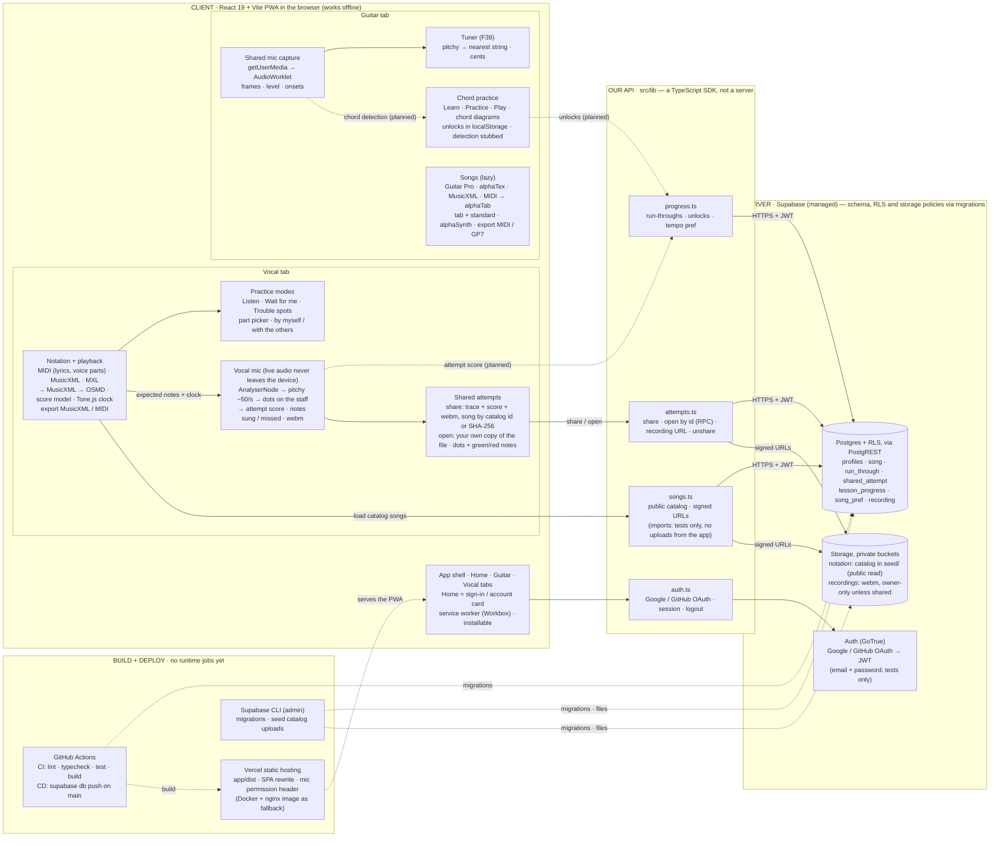

# Harmonic — architecture

Status: current as of 2026-09-30 (M2). Diagram updated 2026-09-30. Owner: whole team. This is the
"boxes and arrows" document for the rubric; the requirement-by-requirement
design lives in `openspec/` and the capacity plan in `docs/scaling-plan.md`.

## In three sentences

Harmonic is an installable web app (React + Vite PWA) that turns any MIDI,
MusicXML or MXL file into sheet music you can hear: the file is converted to
MusicXML in the browser, rendered with OpenSheetMusicDisplay, and played back
by Tone.js in lockstep with a moving cursor, with all timing taken from the
rendered score itself. When you sing along, your microphone is analysed
entirely on your device: pitch is tracked about fifty times a second, drawn
onto the staff as coloured dots, and scored against the melody when the song
ends. The Guitar tab tunes the guitar through the same on-device microphone
path (an AudioWorklet that sees every sample) and renders guitar songs as tab
plus standard notation with alphaTab, which also plays them and exports MIDI
and Guitar Pro. A thin Supabase backend supplies accounts, a shared song catalog, each
user's own library (stored as MusicXML in a private bucket) and progress
rows, all guarded by row-level security, so nothing but small rows and
optional compressed recordings ever leaves the phone.

## Diagram


```mermaid
flowchart LR
    subgraph C["CLIENT · React 19 + Vite PWA in the browser (works offline)"]
        SHELL["App shell · Home · Guitar · Vocal tabs<br/>Home = sign-in / account card<br/>service worker (Workbox) · installable"]
        subgraph CV["Vocal tab"]
            SCORE["Notation + playback<br/>MIDI (lyrics, voice parts) · MusicXML · MXL<br/>→ MusicXML → OSMD · score model · Tone.js clock<br/>export MusicXML / MIDI"]
            VPRAC["Practice modes<br/>Listen · Wait for me · Trouble spots<br/>part picker · by myself / with the others"]
            SHARE["Shared attempts<br/>share: trace + score + webm, song by catalog id or SHA-256<br/>open: your own copy of the file · dots + green/red notes"]
            VAUDIO["Vocal mic (live audio never leaves the device)<br/>AnalyserNode → pitchy ~50/s → dots on the staff<br/>→ attempt score · notes sung / missed · webm"]
        end
        subgraph CG["Guitar tab"]
            CAPTURE["Shared mic capture<br/>getUserMedia → AudioWorklet<br/>frames · level · onsets"]
            TUNER["Tuner (F39)<br/>pitchy → nearest string · cents"]
            GPRAC["Chord practice<br/>Learn · Practice · Play · chord diagrams<br/>unlocks in localStorage · detection stubbed"]
            GTAB["Songs (lazy)<br/>Guitar Pro · alphaTex · MusicXML · MIDI → alphaTab<br/>tab + standard · alphaSynth · export MIDI / GP7"]
        end
    end
    subgraph A["OUR API · src/lib — a TypeScript SDK, not a server"]
        AUTH["auth.ts<br/>Google / GitHub OAuth · session · logout"]
        SONGS["songs.ts<br/>public catalog · signed URLs<br/>(imports: tests only, no uploads from the app)"]
        ATT["attempts.ts<br/>share · open by id (RPC) · recording URL · unshare"]
        PROG["progress.ts<br/>run-throughs · unlocks · tempo pref"]
    end
    subgraph S["SERVER · Supabase (managed) — schema, RLS and storage policies via migrations"]
        GOTRUE["Auth (GoTrue)<br/>Google / GitHub OAuth → JWT<br/>(email + password: tests only)"]
        DB[("Postgres + RLS, via PostgREST<br/>profiles · song · run_through · shared_attempt<br/>lesson_progress · song_pref · recording")]
        FILES[("Storage, private buckets<br/>notation: catalog in seed/ (public read)<br/>recordings: webm, owner-only unless shared")]
    end
    subgraph J["BUILD + DEPLOY · no runtime jobs yet"]
        CI["GitHub Actions<br/>CI: lint · typecheck · test · build<br/>CD: supabase db push on main"]
        HOST["Vercel static hosting<br/>app/dist · SPA rewrite · mic permission header<br/>(Docker + nginx image as fallback)"]
        CLI["Supabase CLI (admin)<br/>migrations · seed catalog uploads"]
    end
    SHELL --> AUTH
    SCORE --> VPRAC
    SCORE -- "expected notes + clock" --> VAUDIO
    CAPTURE --> TUNER
    SCORE -- "load catalog songs" --> SONGS
    VAUDIO -. "attempt score (planned)" .-> PROG
    VAUDIO --> SHARE
    SHARE -- "share / open" --> ATT
    GPRAC -. "unlocks (planned)" .-> PROG
    CAPTURE -. "chord detection (planned)" .-> GPRAC
    AUTH --> GOTRUE
    SONGS & PROG & ATT -- "HTTPS + JWT" --> DB
    SONGS & ATT -- "signed URLs" --> FILES
    CI -. "migrations" .-> DB
    CI -. "build" .-> HOST
    HOST -. "serves the PWA" .-> SHELL
    CLI -. "migrations · files" .-> DB & FILES
```

Lanes left to right. Solid arrows are runtime calls that work today; dotted
arrows are deploy-time, or runtime links marked "(planned)" that are not wired up yet. There is no server code of our own: "our API" is the typed SDK
in `src/lib`, and everything server-side we own is declarative (migrations
for schema, RLS, bucket policies, seed catalog). The diagram's source of
truth is [`3-architecture/rough-architecture.md` in the specifications
repo](https://github.com/Harmonic-416/specifications/blob/main/3-architecture/rough-architecture.md)
(separate repository, `Harmonic-416/specifications`); keep the two in sync.

There are no runtime jobs, queues or custom servers: everything real-time
is on the client, everything persistent is a Supabase row or object.

## Components

### Client (`app/`)

React 19 + Vite 8, packaged as a PWA by `vite-plugin-pwa` (Workbox precache,
4 MiB limit because OSMD + Tone + supabase-js are large). Two tabs: **Guitar**
(tuner + tab songs) and **Vocal** (notation, playback, recording, online catalog, shared attempts).

| Module | Responsibility |
|---|---|
| `tabs/vocal/notation/loadNotation.js` | One entry point for every file: detects MIDI / MusicXML / MXL by extension then by bytes; MIDI → `midi/midiToMusicXml.js`, MXL → unzipped with jszip, MusicXML validated (partwise only). Output is always `{ format, title, content: MusicXML string, sourceBytes }`. |
| `tabs/vocal/midi/*` | The MIDI → MusicXML converter: 16th-note quantization, chords, multiple tracks → parts, key/time signature, first tempo. Documented simplifications: no ties across barlines, no voice separation of overlapping notes, treble clef only. |
| `tabs/vocal/components/SheetMusicViewer.jsx` | Renders the MusicXML with OpenSheetMusicDisplay (OSMD) and exposes a tiny imperative cursor API (`next/reset/show/hide`) plus `getOsmd/getContainer`. |
| `tabs/vocal/notation/scoreModel.js` | Walks OSMD's cursor iterator once after render and derives `{ notes[midi,time,duration,part], playbackSchedule, cursorTimestamps, duration, bpm }` from the rendered score — repeats expanded, tempo changes honoured, ties merged. Because the cursor later steps through exactly these timestamps, audio, cursor and pitch scoring share one clock regardless of input format. |
| `tabs/vocal/playback/useMidiPlayback.js` | Tone.js `Transport` + `PolySynth`; schedules every note and a `cursor.next()` at every timestamp; play / pause / stop / seek. |
| `tabs/vocal/notation/exportNotation.js` | Export MusicXML (or the original MXL bytes) and Standard MIDI (original bytes for MIDI sources, otherwise one track per part rendered from the score model). |
| `tabs/vocal/audio/*` + `components/RecordPanel.jsx` | Prototype: `getUserMedia` → `AnalyserNode` → pitchy (McLeod) at ~50 frames/s; samples are stamped with the Transport clock and only kept while it runs; `useSheetOverlay` records each cursor stop's on-screen box once and plots dots (x interpolated between stops, y from the pitch on a treble staff); `scoreAttempt` counts frames within 50¢ of the melody; a `MediaRecorder` captures webm/opus for later upload. |
| `audio/capture/*` | Shared mic capture: `getUserMedia` → an AudioWorklet (`pcm-capture.worklet.js`) that sees every 128-sample block and, through the pure `FrameAssembler`, posts a frame of the last N samples every 512 samples plus the level and onset events (sudden energy rises, i.e. strums), positioned in samples on the capture context's clock. Takes an existing `AudioContext` to share a clock with playback. First user: the tuner; the chord analyzer is next. |
| `tabs/guitar/tuner/*` | Tuner (F39): pitchy on 4096-sample capture frames → `createStabilizer` (median of 5, nearest standard-tuning string within ±600¢ or a locked string, in tune at ±5¢ held 0.5 s, released past ±8¢) → six string chips, a cents needle and a "play a string" state. |
| `tabs/guitar/notation/*` | `loadGuitarNotation` turns Guitar Pro 3–8 / alphaTex / MusicXML / MXL / MIDI into an alphaTab `Score` (`{ format, title, score, sourceBytes, hasTab }`), reusing the Vocal tab's MXL unzip and MIDI → MusicXML; `exportGuitarNotation` writes MIDI with alphaTab's `MidiFileGenerator` (original bytes for MIDI sources) and Guitar Pro 7 with `Gp7Exporter`. |
| `tabs/guitar/song/*` | Lazy-loaded Songs view: built-in list (`public/guitar-songs/`), upload, and `GuitarScore` — alphaTab rendering tab + standard notation, alphaSynth playback with cursor, click a beat to seek, reusing the Vocal `PlaybackControls`. |
| `lib/supabaseClient.js`, `auth/*`, `components/CloudLibrary.jsx`, `songs/cloudLibrary.js` | Cloud side: a single supabase-js client from `VITE_SUPABASE_*`; session mirrored into React; sign in with Google or GitHub, link the other provider, sign out; **Catalog** list (public, no sign-in needed). Songs are never uploaded (copyright). Without `app/.env.local` the app runs local-only. |
| `share/sharedAttempt.js`, `components/ShareAttempt.jsx`, `SharedAttemptGate.jsx`, `SharedAttemptPanel.jsx` | Shared attempts: after a recorded attempt, the part's notes are marked sung (green) or missed (red); **Share attempt** (signed in) stores the pitch trace, score and optional webm via `src/lib/attempts.ts` and returns `/?attempt=<id>`. The song is named by catalog id or by the SHA-256 of the file. Opening a link (signed in) loads a catalog or built-in song automatically, otherwise asks for the viewer's own copy and checks the fingerprint, then redraws the dots and note marks and plays the recording. |
| `share/attemptPdf.js`, `components/SaveAttemptPdf.jsx` | **Save PDF** (after an attempt, and on a shared attempt): re-renders the score off-screen at page width, paints the part's notes sung / missed (other parts grey) and the pitch dots as SVG attributes, and writes A4 pages of whole systems with jsPDF + svg2pdf.js (vector, lazy-loaded, kept out of the precache). |

### Shared backend layer (`src/lib/`)

Framework-neutral TypeScript on top of supabase-js — the same code runs in
the browser (via the Vite alias `@backend`) and in Node for the integration
tests. `songs.ts` is the important one: `listLibrary`, `getNotationUrl`
(signed URL, 1 h), `importMusicXml` (validates the root element, uploads to
`notation/<user_id>/<uuid>.musicxml` and inserts the `song` row; the app no
longer calls it, since songs aren't uploaded for copyright reasons), `importMidi`
(best-effort monophonic MIDI → MusicXML), `uploadRecording` / `getRecordingUrl` (private bucket, owner
folder, linked to a `run_through`). `attempts.ts` shares attempts:
`shareAttempt`, `getSharedAttempt` (an RPC, so shares can't be listed),
`getSharedRecordingUrl`, `listMySharedAttempts`, `deleteSharedAttempt`.
`progress.ts` holds lesson completion, run-through history, last score and
tempo preference.

### Supabase

| Table | Purpose | RLS |
|---|---|---|
| `profiles` | one row per auth user (trigger-created) | owner read/update |
| `song` | catalog rows (`user_id NULL`) and per-user imports (only test users have any; the app doesn't upload); `notation_path` points into the `notation` bucket; `instrument` = guitar or voice | catalog readable by anyone, own rows by the owner; insert/update/delete own only |
| `lesson_progress` | completed lesson-map nodes | owner only |
| `run_through` | one row per finished attempt with a 0–100 score | owner only |
| `song_pref` | per-song tempo (50–100 %) | owner only |
| `recording` | metadata for an uploaded attempt recording | owner only |
| `shared_attempt` | a shared attempt: song (catalog id or file SHA-256), part, pitch trace `[[s, midi], …]`, accuracy, optional recording path, sharer's name | owner only; any signed-in user reads one row by id through `get_shared_attempt()` |

Storage: `notation` is private; anyone can read `seed/` (the catalog),
signed-in users also their own `<user_id>/` folder, and write only in their
own folder (`0004`). `recordings` is private and owner-only, except that a
recording attached to a shared attempt is readable by signed-in users
(`0005`). Migrations `0001` (schema, RLS, buckets), `0002` (three V1 seed
songs), `0003` (voice catalog: Ode to Joy, Twinkle Twinkle, C-major warm-up),
`0004` (public catalog, owner-only notation reads), `0005` (shared attempts) are applied with `supabase db push`; the catalog MusicXML lives in
`supabase/seed/notation/` and is uploaded with `supabase storage cp`.

## Data flows

1. **Open a song.** Built-in list → `fetch('/midi-files/<file>')`; cloud list
   → `getNotationUrl` → GET from the storage CDN. Either way the bytes go
   through `loadNotation` → `SheetMusicViewer` → `extractScoreModel` → the
   playback hook is (re)built and the cursor sits on the first stop.
2. **Share an attempt.** After a recorded attempt, `ShareAttempt` sends the
   pitch trace (rounded, at most 30,000 frames), accuracy, part and song
   reference to `shareAttempt`, which uploads the webm (if included) to
   `recordings/<user_id>/<id>.webm` and inserts the `shared_attempt` row. The
   link `/?attempt=<id>` is offered through the share sheet or clipboard. App
   keeps a link's id in sessionStorage so it survives the OAuth round trip.
3. **Record an attempt.** Mic permission → `AudioContext` + analyser →
   playback starts → each analysed frame becomes `{time, midi, clarity}` and a
   dot on the staff → when the transport stops, `scoreAttempt` produces
   `{accuracy, inTune, scoredFrames}`, `judgeNotes` marks each note of the
   part sung or missed (the Trouble spots rule), and the webm blob is offered
   for download or sharing (flow 2).
4. **Sign in.** `signInWithProvider` from `auth.ts` sends the browser to
   Google or GitHub via Supabase and back with the session in the URL
   fragment; supabase-js stores it in localStorage and refreshes tokens;
   `useSession` mirrors it and the cloud lists re-fetch when the user id
   changes. `register` / `login` (email + password) are used only by the
   backend tests to create throwaway users.

## Decisions and constraints

- **MusicXML is the canonical stored form.** MIDI is converted on the way
  in; MXL is unzipped on the way in. The bucket only ever holds MusicXML, so
  any renderer can consume it and exports are lossless for XML sources.
- **Playback timing comes from the rendered score, not from the importer.**
  This closed a real bug class: the MIDI converter drops notes it cannot
  notate (overlapping notes in one track) but used to keep them in its audio
  schedule, so users heard notes that were not on the page.
- **All real-time audio stays on the device** (README "architecture rules").
  Live mic audio never reaches Supabase; only scores/progress and optional
  compressed recordings do. This is also why the cloud load is tiny (see the
  scaling plan).
- **RLS default-deny is the API.** There is no custom server in V1; the
  client talks to PostgREST/Storage directly with the user's JWT, and every
  table has owner-only policies except the public catalog rows.
- **Two npm packages, one repo.** The backend layer and its integration
  tests are at the root; the PWA is in `app/` and imports the root layer via
  a Vite alias (`@backend`, deduped supabase-js). CI runs both.
- **One renderer per instrument.** Voice uses OpenSheetMusicDisplay, because
  its cursor iterator gives us the timing model for free. Guitar uses alphaTab,
  the only renderer that draws tab; it also plays and exports what it renders.
  Both read MusicXML. alphaTab is lazy-loaded with the Guitar Songs view and
  kept out of the install-time precache (cached on first use).
- **AudioWorklet capture for guitar.** Guitar needs strum onsets to open its
  chord-detection window. Polling an `AnalyserNode` once per animation frame
  (as the Vocal prototype does) can miss them; the worklet sees every sample.
  Vocal can move onto the same capture later.
- **Guitar tab ↔ MIDI.** alphaTab exports MIDI and Guitar Pro but cannot import
  MIDI or work out frets from pitch, so MIDI files open as notation only until
  our fret assignment lands (`openspec/changes/add-guitar-foundation`, task 3.6).

## Testing

| Layer | Where | What | Runs |
|---|---|---|---|
| Unit (app) | `app/tests/*.test.js` (vitest) | converter over the shared MIDI corpus, format detection + MXL unzip, export round trips, pitch detection on sine waves, attempt scoring, staff geometry; capture framing and onsets, tuner string choice / cents / hysteresis, guitar import of every format and MIDI + Guitar Pro round trips | always (`npm --prefix app test`) |
| Integration (backend) | `tests/backend/*.test.ts` (vitest) | auth round trips, RLS isolation, progress persistence, MIDI + MusicXML import → bucket → signed URL read-back, catalog listing | only with `SUPABASE_URL` / `SUPABASE_ANON_KEY` (`.env.local` or CI secrets); registers throwaway users at `*@harmonic-tests.example.com` |
| Browser | manual / Playwright scripts (not yet checked in) | every fixture renders, exports download and re-parse, cloud flow end to end, simulated-microphone attempts score 97–98 % | on demand |
| Load | `tests/load/supabase-baseline.mjs` | ~1.3k requests against the live project, latency percentiles per VU count | on demand, see `docs/scaling-plan.md` |

Shared fixtures live in `tests/fixtures/` (10 MIDI files incl. synthetic
stress cases, 3 MusicXML/MXL files) and are used by both suites.

## Repository map

```
app/                       React + Vite PWA (the client)
  src/tabs/vocal/          notation/ midi/ playback/ audio/ components/ songs/
  src/tabs/guitar/         tuner/ notation/ song/ (alphaTab, lazy-loaded)
  src/audio/capture/       shared AudioWorklet mic capture
  src/auth/, src/lib/      session hook, sign-in panel, supabase client
  public/midi-files/       built-in songs (any .mid/.midi/.musicxml/.mxl)
  public/guitar-songs/     built-in guitar songs (MusicXML with string/fret)
  tests/                   unit tests (vitest)
src/lib/                   shared backend layer (TypeScript, supabase-js)
supabase/migrations/       schema, RLS, buckets, seed rows (applied by CD)
supabase/seed/notation/    catalog MusicXML uploaded to the notation bucket
tests/backend/             integration tests against a Supabase project
tests/fixtures/            MIDI + MusicXML corpus shared by both suites
tests/load/                capacity baseline script
docs/                      this file, scaling-plan.md, M2-design-and-setup.md
openspec/                  requirement-linked specs, proposals, design notes
.github/workflows/ci.yml   CI (backend + app) and CD (db push)
```

## Known gaps

- No HTTPS deployment yet; the build artifact is `app/dist` and any static
  host works (Vercel/Netlify/GitHub Pages) — tracked in
  `openspec/changes/add-devops-infrastructure`.
- Recording upload and `run_through` creation are not wired to the record
  panel; the backend functions exist and are tested.
- Overlay assumes a treble clef and takes the first part as the melody; no
  microphone latency compensation.
- Timewise MusicXML is rejected with a clear message (partwise only).
- The `house-of-the-rising-sun` seed file now exists
  (`supabase/seed/notation/`, generated by `tests/fixtures/guitar/generate.mjs`)
  but still has to be uploaded to the `notation` bucket.
- Guitar: no chord verification or scoring yet; alphaSynth plays on its own
  `AudioContext`, so the one-clock choice for guitar scoring is open; MIDI
  files show no tab until fret assignment lands; guitar songs can't be saved
  to the cloud yet (stored-format question in `add-guitar-foundation/design.md`).
- The tuner and capture worklet are verified in desktop Chrome (fake
  microphone); the iPhone Safari check is still to do.
