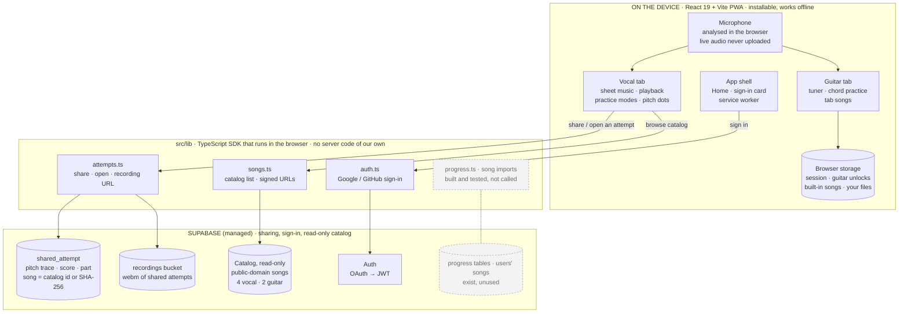
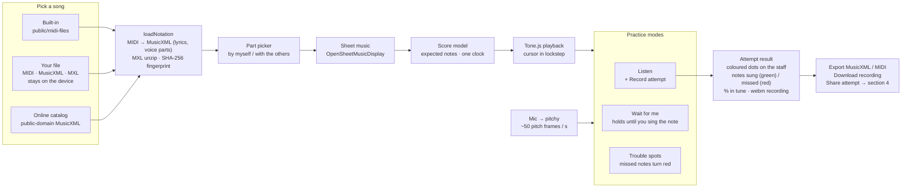
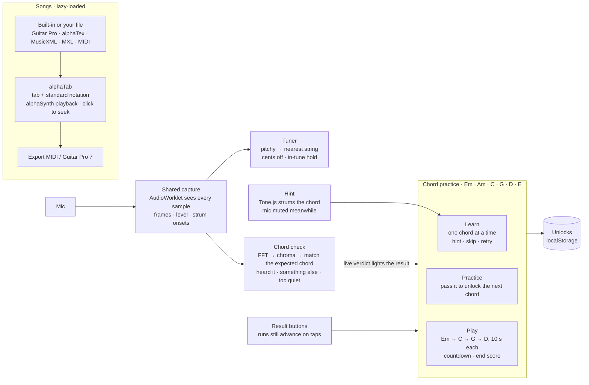
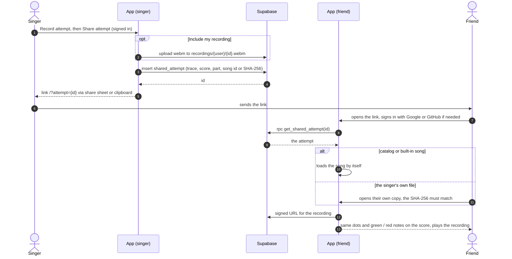

# Harmonic — architecture

Status: current as of 2026-09-30 (`main`). Owner: whole team. This is the
"boxes and arrows" document for the rubric; the requirement-by-requirement
design lives in `openspec/` and the capacity plan in `docs/scaling-plan.md`.

## At a glance

Harmonic is an installable web app (React + Vite PWA) with two instruments.
**Vocal** turns any MIDI, MusicXML or MXL file into sheet music you can hear
and sing against: the pitch you sing is drawn on the staff as coloured dots
and each note of your part is marked sung or missed. **Guitar** tunes the
guitar, teaches six open chords and checks by ear that you played the chord
it asked for, and shows guitar songs as tab plus standard notation.

**Everything happens on the device.** Rendering, playback, microphone
analysis and scoring run in the browser; live audio is never uploaded, and
songs you open (your own files) are never uploaded either (copyright). The
server is used for exactly three things:

| What | Why it needs the server | Sign-in? |
|---|---|---|
| **Sharing an attempt** (the only thing the app writes) | the link has to work on someone else's phone | yes, to share and to open |
| **Sign-in** (Google / GitHub) | sharing needs to know who you are | — |
| **Online catalog** (read-only) | a handful of public-domain songs the team curates | no |

Progress, run-through history, tempo preferences and "my songs" exist in the
backend layer and database (built and tested) but **the app does not use
them**; guitar unlocks are kept in the browser's `localStorage`.

## 1. System overview


```mermaid
flowchart TB
    subgraph DEVICE["ON THE DEVICE · React 19 + Vite PWA · installable, works offline"]
        direction LR
        MIC["Microphone<br/>analysed in the browser<br/>live audio never uploaded"]
        VOCAL["Vocal tab<br/>sheet music · playback<br/>practice modes · pitch dots"]
        GUITAR["Guitar tab<br/>tuner · chord practice<br/>tab songs"]
        SHELL["App shell<br/>Home · sign-in card<br/>service worker"]
        LOCAL[("Browser storage<br/>session · guitar unlocks<br/>built-in songs · your files")]
        MIC --> VOCAL & GUITAR
        GUITAR --> LOCAL
    end

    subgraph API["src/lib · TypeScript SDK that runs in the browser · no server code of our own"]
        direction LR
        ATTLIB["attempts.ts<br/>share · open · recording URL"]
        SONGSLIB["songs.ts<br/>catalog list · signed URLs"]
        AUTHLIB["auth.ts<br/>Google / GitHub sign-in"]
        IDLEAPI["progress.ts · song imports<br/>built and tested, not called"]
    end

    subgraph SUPA["SUPABASE (managed) · sharing, sign-in, read-only catalog"]
        direction LR
        SHARED[("shared_attempt<br/>pitch trace · score · part<br/>song = catalog id or SHA-256")]
        REC[("recordings bucket<br/>webm of shared attempts")]
        CAT[("Catalog, read-only<br/>public-domain songs<br/>4 vocal · 2 guitar")]
        GOTRUE["Auth<br/>OAuth → JWT"]
        IDLEDB[("progress tables · users' songs<br/>exist, unused")]
    end

    VOCAL -- "share / open an attempt" --> ATTLIB
    VOCAL -- "browse catalog" --> SONGSLIB
    SHELL -- "sign in" --> AUTHLIB
    ATTLIB --> SHARED & REC
    SONGSLIB --> CAT
    AUTHLIB --> GOTRUE
    IDLEAPI -.- IDLEDB

    classDef idle fill:#f3f3f3,stroke:#9a9a9a,stroke-dasharray:4 3,color:#6c6a72
    class IDLEAPI,IDLEDB idle
```

Arrows are runtime calls. Grey dashed boxes exist in the code and database,
but nothing in the app calls them. Deploy is not a runtime part: on every push
to `main`, GitHub Actions lints, type-checks, tests and builds, applies the
Supabase migrations (`supabase db push`) and deploys the static build to
Vercel, which serves the PWA (details in `docs/deploy.md`). Every call
to Supabase goes through `src/lib` with the user's JWT; row-level security
in Postgres is what enforces who may read or write what.

## 2. Vocal tab


```mermaid
flowchart LR
    subgraph IN["Pick a song"]
        BUILTIN["Built-in<br/>public/midi-files"]
        UPLOAD["Your file<br/>MIDI · MusicXML · MXL<br/>stays on the device"]
        CATALOG["Online catalog<br/>public-domain MusicXML"]
    end

    LOAD["loadNotation<br/>MIDI → MusicXML (lyrics, voice parts)<br/>MXL unzip · SHA-256 fingerprint"]
    PARTS["Part picker<br/>by myself / with the others"]
    OSMD["Sheet music<br/>OpenSheetMusicDisplay"]
    MODEL["Score model<br/>expected notes · one clock"]
    PLAY["Tone.js playback<br/>cursor in lockstep"]

    subgraph MODES["Practice modes"]
        LISTEN["Listen<br/>+ Record attempt"]
        WAIT["Wait for me<br/>holds until you sing the note"]
        TROUBLE["Trouble spots<br/>missed notes turn red"]
    end

    MIC["Mic → pitchy<br/>~50 pitch frames / s"]
    RESULT["Attempt result<br/>coloured dots on the staff<br/>notes sung (green) / missed (red)<br/>% in tune · webm recording"]
    OUT["Export MusicXML / MIDI<br/>Download recording<br/>Share attempt → section 4"]

    BUILTIN & UPLOAD & CATALOG --> LOAD --> PARTS --> OSMD --> MODEL
    MODEL --> PLAY --> MODES
    MIC --> MODES
    LISTEN --> RESULT --> OUT
```

Dot colours: green in tune (within 50¢), yellow close (within a semitone),
blue right note in another octave, red wrong note, grey during a rest.

## 3. Guitar tab


```mermaid
flowchart LR
    MIC["Mic"] --> CAP["Shared capture<br/>AudioWorklet sees every sample<br/>frames · level · strum onsets"]
    CAP --> TUNER["Tuner<br/>pitchy → nearest string<br/>cents off · in-tune hold"]
    CAP --> DETECT["Chord check<br/>FFT → chroma → match the expected chord<br/>heard it · something else · too quiet"]

    subgraph PRACTICE["Chord practice · Em · Am · C · G · D · E"]
        LEARN["Learn<br/>one chord at a time<br/>hint · skip · retry"]
        PASS["Practice<br/>pass it to unlock the next chord"]
        PLAYRUN["Play<br/>Em → C → G → D, 10 s each<br/>countdown · end score"]
    end

    DETECT -- "live verdict lights the result" --> PRACTICE
    TAPS["Result buttons<br/>runs still advance on taps"] --> PRACTICE
    HINT["Hint<br/>Tone.js strums the chord<br/>mic muted meanwhile"] --> LEARN
    PRACTICE --> UNLOCKS[("Unlocks<br/>localStorage")]

    subgraph SONGS["Songs · lazy-loaded"]
        GFILE["Built-in or your file<br/>Guitar Pro · alphaTex · MusicXML · MXL · MIDI"]
        ALPHA["alphaTab<br/>tab + standard notation<br/>alphaSynth playback · click to seek"]
        GEXP["Export MIDI / Guitar Pro 7"]
        GFILE --> ALPHA --> GEXP
    end
```

Nothing in the Guitar tab talks to the server.

## 4. Sharing an attempt (the only server write)


```mermaid
sequenceDiagram
    autonumber
    actor Singer
    participant A as App (singer)
    participant S as Supabase
    participant B as App (friend)
    actor Friend

    Singer->>A: Record attempt, then Share attempt (signed in)
    opt Include my recording
        A->>S: upload webm to recordings/{user}/{id}.webm
    end
    A->>S: insert shared_attempt (trace, score, part, song id or SHA-256)
    S-->>A: id
    A-->>Singer: link /?attempt={id} via share sheet or clipboard
    Singer->>Friend: sends the link
    Friend->>B: opens the link, signs in with Google or GitHub if needed
    B->>S: rpc get_shared_attempt(id)
    S-->>B: the attempt
    alt catalog or built-in song
        B->>B: loads the song by itself
    else the singer's own file
        Friend->>B: opens their own copy, the SHA-256 must match
    end
    B->>S: signed URL for the recording
    B-->>Friend: same dots and green / red notes on the score, plays the recording
```

The song itself is never uploaded: a shared attempt names it by catalog id or
by the SHA-256 of the file, and the friend supplies their own copy. Shares
can't be listed; a row is only readable through `get_shared_attempt(id)` by
someone signed in who has the link, and only the recording attached to a
share becomes readable to others.

## Components

### Client (`app/`)

React 19 + Vite 8, packaged as a PWA by `vite-plugin-pwa` (Workbox precache,
4 MiB limit; alphaTab and the guitar Songs view are kept out of the precache
and cached on first use).

**Shell and sign-in**

| Module | Responsibility |
|---|---|
| `App.jsx`, `nav/*` | Three tabs (Home, Guitar, Vocal) switched in state, no router. Reads a share link (`/?attempt=<id>`) and keeps the id in `sessionStorage` so it survives the OAuth round trip. |
| `lib/supabaseClient.js`, `auth/*` | One supabase-js client from `VITE_SUPABASE_*` (without `app/.env.local` the app runs local-only); `useSession` mirrors the session into React; sign in with Google or GitHub, link the other provider, sign out. |

**Vocal**

| Module | Responsibility |
|---|---|
| `tabs/vocal/notation/loadNotation.js` | One entry point for every file: detects MIDI / MusicXML / MXL by extension then bytes; MIDI → `midi/midiToMusicXml.js` (quantized, chords, tracks → parts, lyrics, voice-part clefs), MXL unzipped with jszip. Output is always MusicXML. |
| `tabs/vocal/notation/partFilter.js` | Lists parts; builds "your part alone" or "your part on top of the others". |
| `tabs/vocal/components/SheetMusicViewer.jsx` | OpenSheetMusicDisplay in a sideways-scrolling strip; cursor API and per-note marking. |
| `tabs/vocal/notation/scoreModel.js` | Walks OSMD's cursor once and derives notes, cursor timestamps and the playback schedule from the rendered score, so audio, cursor and scoring share one clock. |
| `tabs/vocal/playback/useMidiPlayback.js` | Tone.js `Transport` + `PolySynth`, cursor stepping in lockstep; play / pause / stop / seek. |
| `tabs/vocal/practice/*`, `WaitModePlayer`, `TroubleSpotsPlayer` | Wait for me (hold detector) and Trouble spots (per-note hit / miss), octave-agnostic. |
| `tabs/vocal/audio/*`, `RecordPanel.jsx` | Mic → `AnalyserNode` → pitchy at ~50 frames / s, stamped with the playback clock; dots drawn over the score; `scoreAttempt` (% within 50¢) and per-note sung / missed; `MediaRecorder` webm. |
| `tabs/vocal/songs/cloudLibrary.js`, `OnlineSongs.jsx` | The public catalog (no sign-in); songs are never uploaded. |
| `tabs/vocal/share/*`, `ShareAttempt`, `SharedAttemptGate`, `SharedAttemptPanel` | Sharing (section 4): trace compaction, fingerprints, link parsing; the share button; opening a link (sign in, pick your copy, fingerprint check); redrawing someone else's attempt with their recording. |
| `tabs/vocal/notation/exportNotation.js` | Export MusicXML (or the original MXL) and MIDI. |

**Guitar**

| Module | Responsibility |
|---|---|
| `audio/capture/*` | Shared mic capture: `getUserMedia` → AudioWorklet (`pcm-capture.worklet.js`) → frames every hop, level and strum onsets, positioned in samples. |
| `tabs/guitar/tuner/*` | Tuner (F39): pitchy on capture frames → stabilizer (median of 5, nearest string or a locked one, in tune at ±5¢ held 0.5 s). |
| `tabs/guitar/practice/chordDetect.js`, `useChordDetection.js` | Chord verification (F16): after each strum onset, FFT → chroma vector → cosine match against the six chord templates; verdict `verified` / `wrong` / `silent`. `muteFor` keeps the app from hearing its own hint. |
| `tabs/guitar/practice/PracticeScreen.jsx` + state reducers | Learn, Practice and Play modes, chord diagrams with fret / note / finger labels, string states, hint / skip / retry; unlocks in `localStorage` (`unlocks.js`). Detection lights the result; runs still advance on the result buttons. |
| `tabs/guitar/notation/*`, `tabs/guitar/song/*` | Lazy-loaded Songs view: Guitar Pro 3–8 / alphaTex / MusicXML / MXL / MIDI → alphaTab (tab + standard), alphaSynth playback with cursor and click-to-seek, export MIDI and Guitar Pro 7. |

### Backend layer (`src/lib/`)

Framework-neutral TypeScript over supabase-js; the app imports it as
`@backend/*` and the integration tests run the same code in Node.

| File | Functions | Used by the app? |
|---|---|---|
| `auth.ts` | `signInWithProvider`, `logout`, `getSession`; `register` / `login` (email + password) | OAuth + logout yes; email + password only in tests |
| `attempts.ts` | `shareAttempt`, `getSharedAttempt` (RPC), `getSharedRecordingUrl`, `listMySharedAttempts`, `deleteSharedAttempt` | share, open and recording URL yes; list / delete not yet |
| `songs.ts` | `listLibrary`, `getNotationUrl` | yes (catalog) |
| `songs.ts` | `importMusicXml`, `importMidi`, `uploadRecording`, `getRecordingUrl` | no (tests only; uploads are off for copyright) |
| `progress.ts` | lesson completion, unlock evaluation, run-throughs, last score, tempo preference | no (tests only) |

### Supabase

| Table / bucket | Holds | Access (RLS) | Used by the app? |
|---|---|---|---|
| `shared_attempt` | a shared attempt: song (catalog id or file SHA-256), part, pitch trace `[[s, midi], …]`, accuracy, recording path, sharer's name | owner only; anyone signed in reads one row by id via `get_shared_attempt()` | **yes** |
| `recordings` bucket | webm per shared attempt, `<user_id>/<id>.webm` | owner only, plus signed-in read of recordings attached to a share | **yes** |
| `song` (catalog rows) + `notation/seed/` | 6 catalog rows (4 vocal, 2 guitar) over 5 public-domain MusicXML files | readable by anyone | **yes** (read-only) |
| `profiles` | one row per user (trigger-created) | owner | created on sign-up only |
| `song` (user rows) + `notation/<user_id>/` | users' own songs | owner | no (only test users have any) |
| `lesson_progress`, `run_through`, `song_pref`, `recording` | progress, attempts history, tempo, recording metadata | owner | no |

Migrations `0001` (schema, RLS, buckets), `0002`–`0003` (catalog rows),
`0004` (public catalog, owner-only song files), `0005` (shared attempts) are
applied by CI with `supabase db push`; catalog MusicXML lives in
`supabase/seed/notation/` and is uploaded with `supabase storage cp`.

## Decisions and constraints

- **Local-first, server only for sharing.** Everything that can run on the
  device does; the one thing that can't — a link that works on someone
  else's phone — is the one thing the app writes to the server.
- **No song uploads (copyright).** Your files stay on your device. A shared
  attempt names its song by catalog id or file fingerprint; the catalog holds
  only public-domain songs the team curates.
- **All real-time audio stays on the device.** Latency and privacy; only a
  shared attempt's compressed webm is uploaded, and only when you ask.
- **RLS is the API.** No custom server: the browser talks to Supabase with
  the user's JWT, and Postgres policies decide access. Shares are unlisted
  (read by id through a security-definer function).
- **Timing comes from the rendered score.** Playback, cursor and pitch
  scoring all use the score model OSMD rendered, whatever the input format.
- **One renderer per instrument.** OSMD for voice (its cursor gives the
  timing model); alphaTab for guitar (the only one that draws tab, and it
  plays and exports what it renders).
- **AudioWorklet capture for guitar.** Strum onsets open the chord-check
  window; polling an `AnalyserNode` per animation frame can miss them. Vocal
  still uses the `AnalyserNode` path and can move over later.
- **Two npm packages, one repo.** Backend layer and its tests at the root,
  PWA in `app/` importing it through the `@backend` alias. CI runs both.

## Testing

| Layer | Where | What | Runs |
|---|---|---|---|
| Unit (app) | `app/tests/*.test.js` | MIDI → MusicXML over the shared corpus, lyrics, parts, format detection, exports; pitch detection, attempt scoring, practice modes; shared-attempt traces, fingerprints, links; capture framing and onsets; tuner; chord detection on synthetic strums; guitar practice / play / unlock reducers; guitar import and exports | every PR (CI) |
| Integration (backend) | `tests/backend/*.test.ts` | auth, RLS isolation, public catalog, shared attempts (share, open by id, recording access, unlisted, unshare), progress, imports | with `SUPABASE_URL` / `SUPABASE_ANON_KEY` set (locally; CI has no test project yet, so they skip there) |
| Browser | manual / scripted headless Chrome with a synthetic microphone | sing an attempt, share, open as another user (catalog, built-in, own file with fingerprint check) | on demand |
| Load | `tests/load/supabase-baseline.mjs` | latency and throughput of the live project | on demand, see `docs/scaling-plan.md` |

## Repository map

```
app/                       React + Vite PWA (the client)
  src/tabs/vocal/          notation/ midi/ playback/ practice/ audio/ share/ songs/ components/
  src/tabs/guitar/         tuner/ practice/ (chord check) notation/ song/ (alphaTab, lazy)
  src/audio/capture/       shared AudioWorklet mic capture
  src/auth/, src/lib/      session hook, sign-in and account cards, supabase client
  public/midi-files/       built-in vocal songs
  public/guitar-songs/     built-in guitar songs
  tests/                   unit tests (vitest)
src/lib/                   backend layer (TypeScript, supabase-js)
supabase/migrations/       schema, RLS, buckets, catalog rows, sharing (applied by CI)
supabase/seed/notation/    catalog MusicXML
tests/backend/             integration tests against a Supabase project
tests/fixtures/            MIDI + MusicXML corpus shared by both suites
tests/load/                capacity baseline script
docs/                      this file, scaling-plan.md, deploy.md, M2-design-and-setup.md
openspec/                  requirement-linked specs, proposals, design notes
.github/workflows/ci.yml   CI (lint, typecheck, test, build) and CD (db push, Vercel deploy)
```

## Known gaps

- **Guitar:** chord detection shows its verdict, but Learn / Practice / Play
  still advance on the result buttons; no strumming-pattern or timing score
  yet; MIDI files open without tab (no fret assignment); guitar songs can't
  be shared.
- **Vocal:** the pitch-dot overlay assumes a treble staff, so on the bass and
  tenor (treble-8vb) staves MIDI imports now get, the dots sit at the wrong
  height; no microphone latency compensation; timewise MusicXML is rejected (partwise only).
- **Sharing:** no "stop sharing" button yet (`deleteSharedAttempt` exists);
  sharing only from Listen mode; the recording isn't synced to the cursor.
- **Progress** (unlocks, run-through history, tempo) isn't saved to the
  server; guitar unlocks live in one browser only.
- **Backend tests don't run in CI** until a dedicated test Supabase project's
  URL and key are added as secrets.
- The tuner, chord check and capture worklet are verified in desktop Chrome;
  the iPhone Safari check is still to do.
