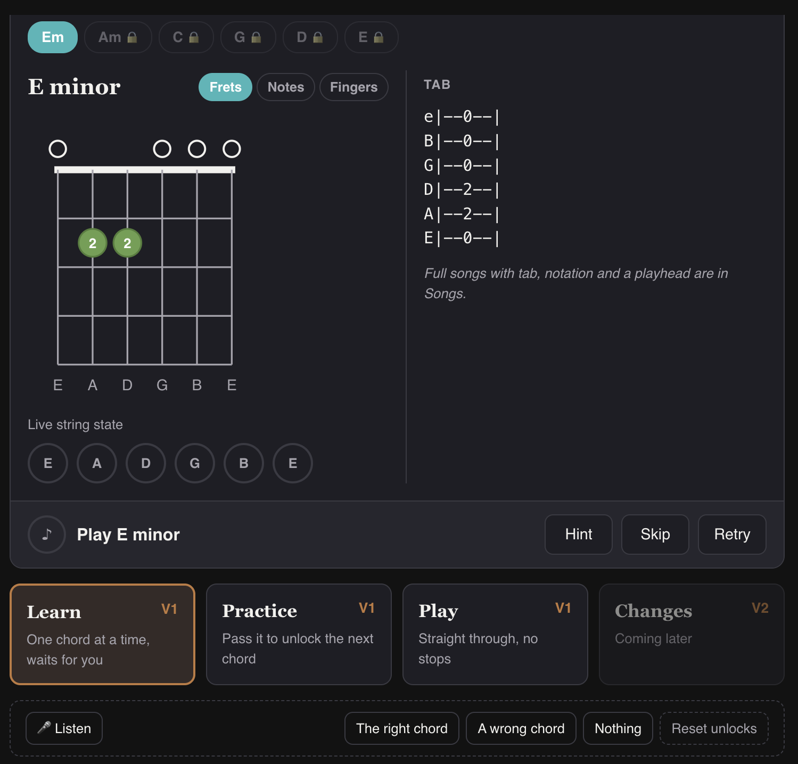
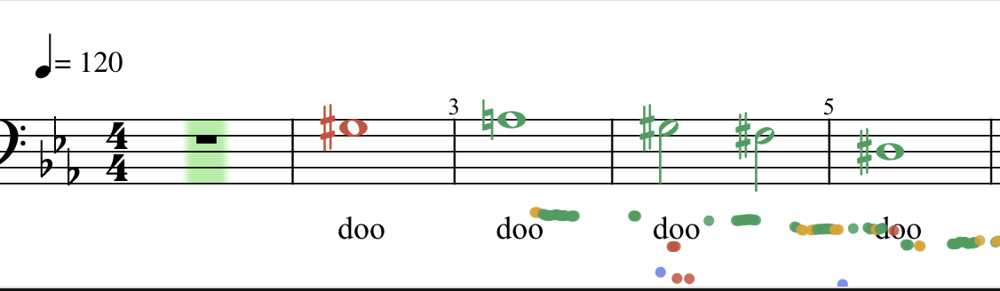
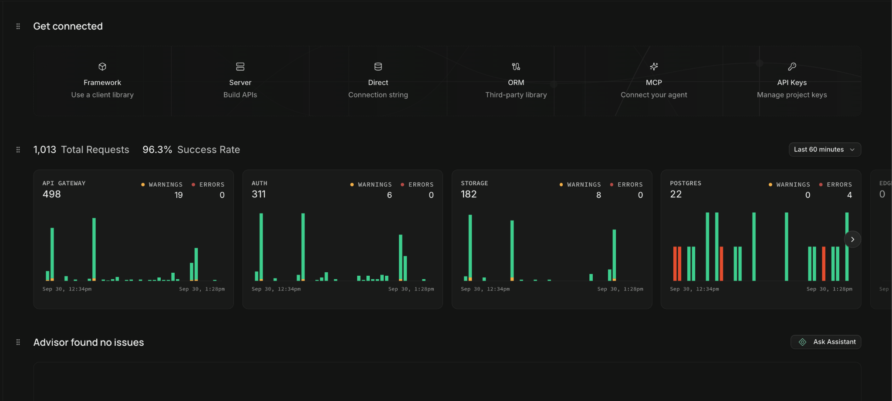
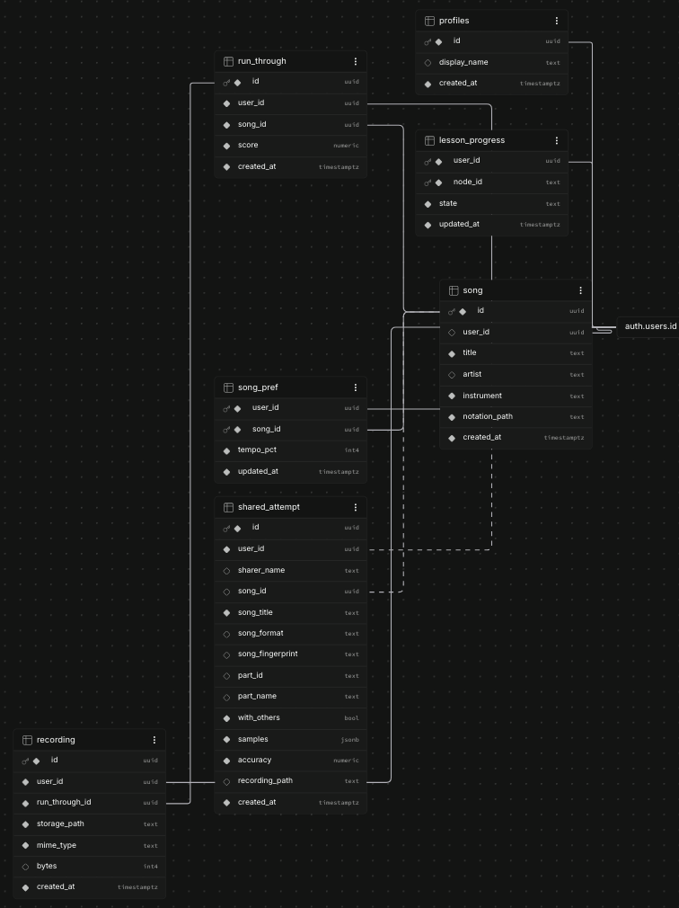
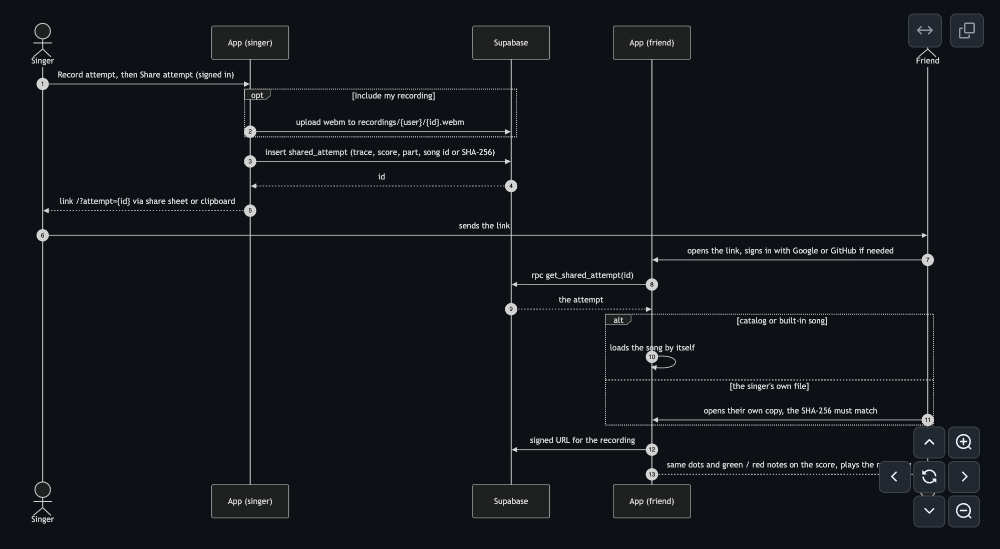
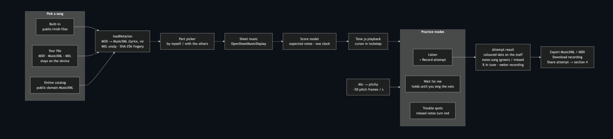
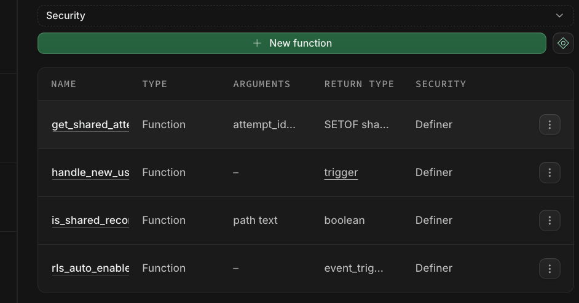

 # Design Document for Harmonic

**Last Updated: Milestone 2 Review (Wednesday, September 30, 2026)**

---

## 1. Introduction

Harmonic is an installable progressive web application (React JS + Vite) that can convert MIDI, MusicXML, MXL, and Guitar Pro files into sheet music for users to hear and sing/play along to. In Version 1 (V1), Harmonic supports two instruments: vocals and guitar. When a user opens a song, Harmonic will render it as music notation and play it back in sync with a moving cursor. When a user sings or strums guitar strings, his/her device's microphone will detect the pitch or chord in real time. This analysis is completed locally on the user's device.

Harmonic also employs a Supabase backend to store a shared catalog of songs and handle user accounts, including authentication, progress tracking, and personal library maintenance.

---

## 2. User Interface

### 2.1 Design

The user interface (UI) is a thin reactive shell that renders any content provided by the scoring engine and notation renderer. Moreover, it dispatches user actions (skip, hint, tempo change) back down. The shell doesn't own any music logic itself. Three features define nearly the entire user experience: guided lessons, live practice runs, and run-through summaries.

### 2.2 Guided Lessons (shelved)

Lessons sit on an unlocking map, and a new lesson becomes available to users only once its prerequisites are met (e.g. all previous lessons are completed). Each lesson node walks the user through three stages in order: a concrete explanation of the notation, an instrument-free drill, and a played exercise on the actual instrument.

During the played exercise, the notation cursor leads the user through the piece, holding onto each note or chord until it's verified as being played correctly. To prevent getting stuck, a hint button that plays the expected note or chord once and, for guitar, animates the correct fingering onto the fretboard diagram. Pressing either dispatches an intent to the guided-mode state machine that lives in the scoring engine that changes its state. In these cases, the UI simply renders the new state that the machine reports back.

This design lets users fail without getting stuck on a single note or lesson. The soft gate (holding onto each note or chord until it's verified) provides users with real-time feedback while keeping practice moving. At the same time, every miss, skip, and auto-advance is logged in the notation, providing users and their instructors alike with visibility into pain points within a single passage.

*Photo: Guitar lesson*

### 2.3 Live Practice Runs

Live practice runs are uninterrupted run throughs of a passage. Once a user starts singing or playing, a live-feedback session shows what the microphone is picking up against what the score expects, and both are updated continuously as the run through proceeds. For vocals, the detected and expected notes are displayed, and for guitar, the chord and the state of each string is visualized. For guitar, strings that are under-pressed or muted are also flagged whenever that data is available. If the user input is too quiet to make a reliable call, the app shows an explicit "couldn't hear you" state instead of logging the moment as a miss.

*Photo: pitch detection for song*

This design supports scalability because the live feedback mechanism isn't instrument-specific. Every detection analyzer (pitch for voice, chord-FFT for guitar) emits the same normalized event, so the UI simply renders the response it's given without further processing. Additional instruments can be added to the application with little to no modifications to this mechanism.

### 2.4 Run-through Summaries

When a user finishes a live practice run, the scoring engine produces a summary of the attempt and analyzes it note by note, chord by chord. Pitches are labelled verified (green), wrong (red), or not-heard (gray), and rhythmic accuracy will be measured as early, on-time, or late. All this feedback is marked directly on the rendered notation, providing users with a clear roadmap of what went wrong and where.

Each attempt is added to the passage's history, and only the most recent score surfaces back on the lesson map. In this way, all attempts become part of a visible trend, facilitating progress tracking. To support this, attempt history and song storage features were designed to live in the backend, separate from the scoring engine and notation renderer capabilities of the frontend.

---

## 3. Core Audience

Harmonic aims to provide value to students unserved by existing instrument learning tools.

### 3.1 Independent Learners

This category includes self-directed learners with little prior musical experience and no access to an instructor. The concept-explanation and instrument-free drill stages of Harmonic's guided lessons instill fundamental theory and ear training from the very first lesson, and its sequential and prerequisite-gated structure provides students with a learning path that ensures skills build in order. Additionally, the soft gate feature advances students consistently to prevent them from getting stuck on one passage, disencouraging abandonment.

### 3.2 Stranded Intermediates

This category includes students who have mastered beginner technique and theory but lack a clear path toward further learning. Harmonic's live, automated feedback lets these musicians continue practicing without a fixed lesson plan by replacing the structured curriculum they've outgrown with real-time correction on whatever piece they choose to work on. Run-through summaries, updated notations, and saved score history empowers such students to identify areas of improvement, rework them, and track their progress over time.

### 3.3 Returning Musicians

This category includes lapsed players who retain some physical technique but have lost skills in fundamental theory and ear-training. The concept-explanation and instrument-free drill stages of Harmonic's guided lessons rebuild that foundation directly. Skip, tempo, and soft gated controls then let them move past material they are already familiar with, enabling such students to make the most of the limited time they have to practice each day.

---

## 4. Software Stack

### 4.1 Frontend Framework

The client is a React app built with Vite. This structure was chosen for its fast iteration loop and wide tooling support. It's packaged as an installable progressive web application (PWA), which offers a strong foundation for fast deployment and doesn't require a new native build pipeline for every platform.

- App: React 19 + Vite, packaged as an installable PWA that works offline. Heavy parts (alphaTab, the PDF code) download only when first used.
- Notation: OpenSheetMusicDisplay for voice. Its cursor gives the timing and expected notes, so playback, cursor and scoring share one clock. alphaTab for guitar, the only web renderer that draws tabs.
- Playback: Tone.js for voice; alphaTab's own synth (alphaSynth) for guitar songs.
- Audio:
  - Voice: pitchy (McLeod pitch method) on the mic, about 50 times a second.
  - Guitar: a shared AudioWorklet capture that sees every sample and detects strums, feeding the tuner (pitchy) and chord verification. Chord verification compares each strum's energy per note name (C to B) against templates of the chords the app teaches.
- Only shared uploads ever leave the device.

### 4.2 Backend Infrastructure

Supabase (managed), used for three things:

1. Sign-in: Google/GitHub OAuth, which issues the login token (JWT).
2. Public catalog: song rows plus MusicXML files, readable without an account.
3. Shared attempts: one table holding the pitch trace, score, part and song reference, plus an optional recording in a private bucket.

Progress, run-history and tempo tables exist and are tested, but the app doesn't write to them yet.

### 4.3.1 SCHEMA

The app calls a small TypeScript layer in `src/lib` (not a server), which talks to Supabase over HTTPS with the user's JWT:

- `auth.ts`: OAuth sign-in, session, sign-out.
- `songs.ts`: catalog list and time-limited download links.
- `attempts.ts`: share, open by id, recording link, unshare.

### 4.3.2 Sharing an Attempt

### 4.3.3 Vocal Architecture

### 4.3.4 Guitar Tabs

### 4.3.5 System Overview

### 4.4 Main data flows:

- Open a song: built-in files come from the app itself, catalog songs through a time-limited link. Either way the file becomes MusicXML in memory and goes to the renderer.
- Share an attempt: the trace and score are saved as one row, plus the optional webm recording, and a link `/?attempt=<id>` is returned.
- Open a share: the row is fetched through a function that returns exactly one attempt, the recipient's copy of the song is matched, and the attempt is redrawn.

### 4.5 Functions and our database functions

---

## 5. Architecture Rationale

Four decisions shaped the majority of the codebase's design and implementation.

### 5.1 Scalability

Every audio analyzer emits an identical, normalized event, timestamped by the same transport clock that also drives playback, the cursor, and the countdown. The scoring engine captures these events without any visibility into which analyzer produced them, which keeps the scoring logic lean and ensures every event remains consistent on a single shared timeline. As a result, support for another instrument can be added with little to no modification to this mechanism.

### 5.2 Real-Time Responsiveness

The microphone feeds an AudioWorklet that produces raw PCM, and every stage of analysis runs entirely client-side. Only scores, progress data, and a compressed recording (optional) are ever sent to Supabase. This design eliminates network latency as a concern, enabling real-time feedback during guided lessons and live practice runs. Beyond maximizing the user experience with a native-app feel as a PWA, this design also keeps the backend minimal, with no real-time processing burden of its own.

### 5.3 Standardization

Because licensing restrictions prevent the app from hosting copyrighted music on its own servers, any file a user uploads must instead be processed and stored locally on their device. This requires the app to accept music files in any common format. To keep the experience consistent across formats and features, every uploaded file is converted to and stored as MusicXML regardless of its original format. This standardization allows a single stored file to serve multiple renderers across instruments, and establishes that file as the sole source of truth, from which playback timing is derived directly from the rendered score itself.

### 5.4 Code Leanness

The application requires no custom server, no dedicated runtime environment, and no additional custom APIs. Although it is front-end heavy, computation occurs primarily on the client side, with the Supabase backend being pre-built and requiring configuration only. Authorization is handled at the database level, and every table is governed by row-level security policies scoped to the authenticated user. The only exception is the public song catalog, which any user can read from but none can write to. A request without a valid JWT for the correct owner is rejected directly by Postgres. As a result, access control lives in the database and doesn't require more application code. Combined with standardized music files and a scalable scoring engine, this keeps the system's operating overhead minimal.

---
